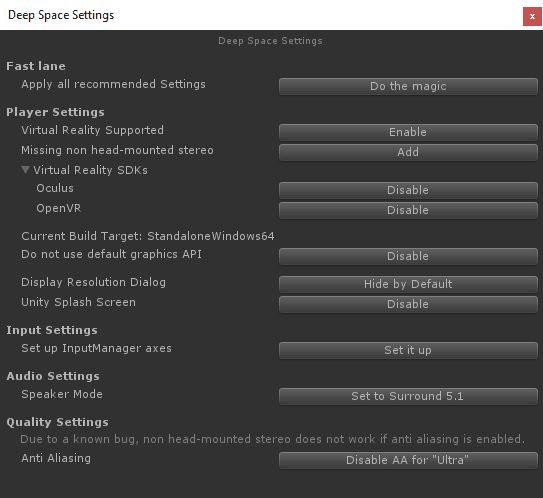
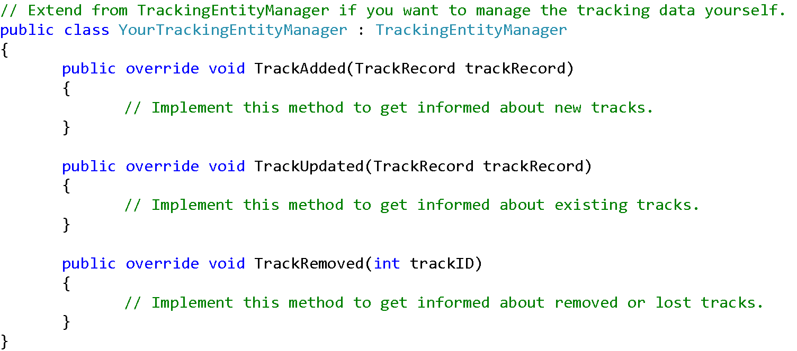
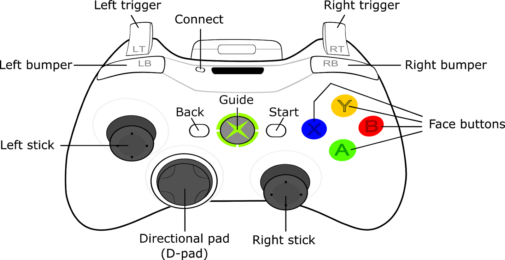
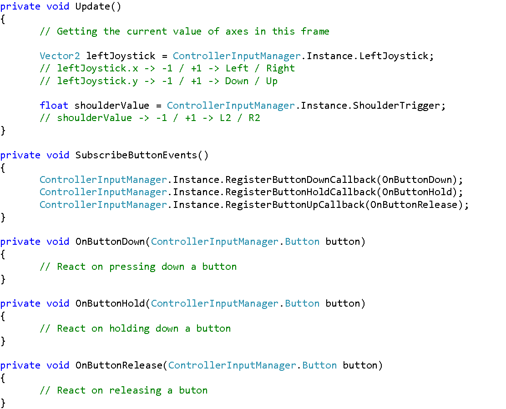

# Implementation Details

In this section, everything that is provided by the DevKit is explained in detail.

[[_TOC_]]

## Structure

Everything that belongs to the SDK has been put in the Assets Subfolder `DeepSpace`. The directory
names are self-explaining.

All classes are packed into the `DeepSpace` namespace or sub namespaces.

## Project Settings

Depending on what you want to do in your Unity application, there need to set up some settings to
achieve these aims. All suggested settings can be done via an integrated editor window, which can be
found in the menu: `Tools -> DeepSpace -> Settings`...



You can do all recommended settings by pressing the “Do the magic” button on the very top, or only
do selected settings by clicking the available buttons. The descriptions should be self-explaining.
Once a button was pressed and the setting was changed, the button vanishes. If there are no buttons
left to press, everything is set up as recommended.

All Settings can of course also be done manually by using Edit -> Project Settings… and setting up the
things you want.

Some settings are default values in Unity 2018.3.x that had other default values in earlier versions. If
you are using the DevKit in older versions of Unity (which is not supported anymore, but should be
possible in principle) you might want to follow these additional recommendations:

- *Editor Settings*: Set Asset Serialization Mode to “Force Text”.
- *Player Settings*: Activate “Run In Background” (under Resolution and Presentation).
- *Player Settings*: Activate “Visible In Background” (under Resolution and Presentation).

## Provided Functionality

Depending on what you plan to do there are some scripts and prefabs for standard situations that
are provided by this SDK.

### Command Line Configuration

In general, we are using command line arguments to configure dynamic parameters. For example,
where the application runs (on the wall or on the floor), IP addresses and ports (to know how to
connect to each other or to any other hardware), or if there shall be shown a debug UI.

You can use your own command line arguments by deriving from the CmdConfigManager class and
overriding the ParseArgument Method. If you need a callback, after all parameters have been parsed,
you can implement the virtual method FinishedParsingArguments. Have a look at the
UdpCmdConfigMgr to learn more about this.

Arguments are passed to the application by the key=value scheme. Do not use spaces around the
equal sign between key and value. All keys are processed as lowercase, so it does not matter if you
write `-mode`, `-Mode`, or `-MODE`. The result might look like this:

```
YourDeepSpaceApp.exe -mode=Wall -udpAddress=192.168.0.1 -udpPort=1234
```

If you want to have more control over your ports, use `-udpSendingPort` and `-udpReceivingPort`
instead of `-udpPort`. You will then do something like this:

```
YourDeepSpaceApp.exe -mode=Wall -udpAddress=127.0.0.1 -udpSendingPort=4444
-udpReceivingPort=8888
```

```
YourDeepSpaceApp.exe -mode=Floor -udpAddress=127.0.0.1 -udpSendingPort=8888
-udpReceivingPort=4444
```

What `-udpPort` does is depending on the `-mode`. On the wall, it will set the sendingPort to the
`udpPort` and the `receivingPort` to `udpPort + 1`. On the floor, it will set the `sendingPort` to `udpPort + 1`
and the `receivingPort` to `udpPort`.

### Wall-Floor-Camera

An often wanted camera view is a connected Wall-Floor-Camera, which means that a user who
stands in the so called sweet spot can look at Wall and Floor without seeing the edge between these
two projection planes. This effect is created by an off-axis projection.

This setup can be taken directly from the WallFloorCombinedScene which can be found in
`Assets/DeepSpace/Demo/Scenes`. Alternatively you can use the prepared prefabs and scripts to build
the setup yourself as described in the following paragraphs.

In the Prefabs directory is a prefab called `CameraSetup` which represents a connected Wall-Floor
Camera. This Camera Setup needs to be used together with the `WallFloorStarter` (or a derived class)
Script. The Camera Setup is using two cameras, one for the Wall and another one for the Floor. They
are configured to be both visible at the same time in the GameView. The wall camera is rendered in
the upper half of the view, the floor camera is rendered in the lower half. If you have set the
GameView resolution to 16:9, both camera views are squeezed together. If you want, you can set the
Resolution to 16:18 (1600 x 1800). You can ignore the Message in the GameView that tells you that
the “Scene is missing a fullscreen camera” because the WallFloorStarter Script will (depending on the
configuration) disable one of the cameras and set the other one back to fullscreen. This makes it
possible to build one application and copy it to both cluster machines.

If you want to translate or rotate the camera, do not change the Unity Camera itself. Move and
rotate the Camera Setup instead. Of course, as soon as you are moving the Camera Setup
dynamically (by some kind of input), you need to send the translation over the network. Therefore,
you should not move the Camera Setup directly, but the NetworkTransformTarget. For details, have a
look at the ​Networking​ Section.

If you want to change the SweetSpot, translate the Observer GameObject, which is a child of the
CameraSetup. The Observer represents the head of a visitor in the Deep Space 8K and is responsible
for the view. To see, where the Observer stands in the Deep Space, activate the WallProjectionPlane
and the FloorProjectionPlane objects. If you do not want to see the view frustum anymore, you can
tick off the “Draw Debug” value from the Observers CameraOffAxisProjection Script or change the
wall color and floor color values.

Rotating the Observer is currently not implemented. If you want to do so, feel free to extend the
CameraOffAxisProjection Script.

### pharus - Laser Tracking

One of the nicest ways to interact with an application in the Deep Space 8K is by using the Laser
Tracking System, because it is a multi-user-input-system that can handle up to 30 users at the same
time.

Pharus, a software that receives the data from our laser rangers and calculates current positions of
people in the room, is developed by Otto Naderer, a Futurelab Programmer. The network interface
on the Unity side was originally implemented and open sourced by Andreas Friedl from the UAS
Upper Austria / Hagenberg and can be found in a GitHub git repository. This DevKit used this
implementation in earlier versions to interact with Pharus. After a lot of refactoring, there are only
little intersections left.

#### Basic Setup

Two protocols can be used to interact with Pharus. Its own protocol “TrackLink” or the well-known
“TUIO” protocol. We recommend using the TUIO protocol, because it is light, easy to handle and well
documented. Only use TrackLink if you want to make use of advanced features like echoes (foot step
recognition).

Getting tracking data from Pharus is easy. Two Scenes (PharusTracklinkScene and PharusTuioScene)
are prepared to show a simple sample how to use the tracking. (Find more information about this in
the Demonstration section.) Depending on the protocol you want to use, you only have to set up
your scene slightly different.

#### Working with Tracking Data

To use TUIO tracking, you need a TuioReceiveHandler Component (this is receiving and gathering the
TUIO data from the network) in the scene. To use TrackLink, you need an UdpReceiver Component
(that receives the data) and a TracklinkReceiveHandler Component (to gather the TrackLink data) in
the scene. For both setups, a TrackingEntityManager Component can be used to make something
with the data. The TrackingEntityManager is independent from the selected tracking method and
therefore works with TUIO and TrackLink. If you want to extend the functionality, the easiest way is
to create a class and derive from TrackingEntityManager. In this case, you can overwrite the following
methods:
- `TrackAdded` - is called when a new Track was added.
- `TrackUpdated` - is called once per Unity Update, to give you updates about existing tracks.
- `TrackRemoved` - is called, when a Track has left the tracked area (Deep Space floor) or got lost (e.g. because
the person was jumping).

A Track is a person (or tracked object) standing or moving in the Deep Space. The TrackAdded and
TrackUpdated methods get a TrackRecord instance passed as parameter. A TrackRecord is holding all
data of a Track (e.g. position, speed, rotation, etc.). The TrackRemoved method get a trackID as
parameter to know which track was removed.



In the snippet can be seen, how to access the tracking data. The TrackRecord class that you can
find in the SDK, is well documented and will answer questions about what a Track is in detail.

If you do not want or can derive from TrackingEntityManager, you can have a look at the
implementation of this class to have a look at how to register for these callback methods by
registering at an instance of TrackingReceiveHandler and by implementing the ITrackingReceiver
interface. All classes can be found in the `DeepSpace.Lasertracking` namespace.

To simulate activity in the Deep Space 8K at your place, you can use the Pharus-ReplayOnly
application. Therefore, start one of the batch files (Start*.bat) in the pharus-replay folder or take one
of the “.rec” Files and drop it onto Pharus.exe. Pharus will open and the chosen record file (recorded
movement data in the Deep Space) will play in an endless loop.

To get a first impression of how these recorded data can be used in a Unity application, just open the
PharusTUIOScene or PharusTracklinkScene. Please have a look at the Demonstration section for more
details.

#### Configuration

To work with TrackLink and Pharus in different setups (e.g. on a development machine and in the 
Deep Space directly), there are existing two config files in json format.

In `Assets/StreamingAssets/DeepSpaceConfig` the files `tracklinkConfig.json` and `tuioConfig.json` can be
found. Both contain the basic network information and the virtual size (`screenWidthPixel` and
`screenHeightPixel` in pixel) and real size (`stageWidth` and `stageHeight` in centimetres) of the
tracking area. This is required to map a real person in the Deep Space onto the display (projection).

### Xbox Controller

The Deep Space SDK provides a controller input manager that wraps the Unity input system for
controllers. All functionality is packed into the ControllerInputManager class. It is a singleton and can
be accessed easily from all other script components. To make the wrapper work, the Unity Input
Settings have been already set to support all controller keys. If you export the
ControllerInputManager Script to another project, do not forget to copy the InputManager.asset file
from the ProjectSettings directory too.



#### Accessing Axes

All axes are defined in a range between `-1` (Left or Down) and `+1` (Right or Up). To access them, just
read out the now described class attributes:

- *Left stick*: Accessible via Vector2 LeftJoystick
- *Right stick*: Accessible via Vector2 RightJoystick
- *Directional pad*: Accessible via Vector2 DPad
    - x value: left / right
    - y value: up / down
- *Left trigger / Right trigger*: Accessible via float ShoulderTrigger

#### Accessing Buttons

Interacting with buttons can end in three states:

1. *ButtonDown*: Pressing the button down (called once)
2. *ButtonHold*: Keeping the button down (called each frame the button is pressed)
3. *ButtonUp*: Releasing the button (called once)

These states can be accessed in callback events (see following snippet). All callbacks receive a Button
enum type as parameter that defines the button that was interacted with. The enum values are
named intuitive, but to sum it up:

- *Face buttons*: Button.A, Button.B, Button.X, Button.Y
- *Right bumper / Left bumper*: Button.R1, Button.L1
- *Back / Start*: Button.BACK, Button.START
- *Pressing down Right stick or Left stick*: Button.R3, Button.L3



Please have a look at the CameraController.cs Script to see how the Controller can be used.

Note that the Xbox gamepad is only connected to the wall machine. Therefore, the wall application is
the only one that recognizes the input. If you want to send button or axis events to the floor
machine, you have to receive the events on the wall and send it over to the floor via networking. This
can be easily done by ​cf. *Extending the Networking​*.

### VRPN Plugin

In addition to the aforementioned ways of communication, it is also possible to use the built-in VRPN
server in the Deep Space. The VRPN server is mainly used by VRController. As mentioned before, it is
an Android application to start, stop and control Deep Space applications. Using VRController brings
additional control possibilities such as interacting with buttons or using its virtual touchpad that
sends touch positions to Unity3d applications through [VRPN protocol](https://github.com/vrpn/vrpn).

Implementing the VRPN plugin in Unity is straightforward. All you need is to put the attached
TrackerHostSettings script into your scene and to set the IP (or hostname) of your VRPN server in
that script.

Generally speaking, VRPN can be used to track three different types of data:
The `​Tracker​` type delivers information about position and orientation, the ​Analog​ type contains axis
information of any type (e.g. joystick) and finally, the `​Button​` type is a binary type that delivers
information about the state of a button and whether it is on or off.

The `VRPN_HOST` script retrieves the current states of all these values from the server. It provides an
interface of four methods:


The first argument `tracker` describes the name of the VRPN device. In case you are using the
aforementioned VRController in Deep Space, it has to be `Tracker0`. The second argument `channel`
corresponds to the channel of the data (since VRPN devices usually support several channels for
different hardware inputs), which is in the case of Deep Space for both methods `GetPosition` and
`GetOrientation` `0`. Buttons are linked to different channels since you have to use one channel per
button. A nice feature of the VRController is that you can define all your buttons in the Deep Space
CMS and link them to different ID's (channels). They will appear at the VRController screen when
your application is running.

### Networking

In general: You are free to use any networking library (UNET or 3rd party) to synchronize the state
between the Wall and Floor application. The reason why we decided to implement some networking
messages ourselves was because of performance and control. Using UDP directly is slightly faster
than using UNET. You buy this little performance by a big loss of features and comfort.
Nevertheless, you can extend and use this feature if you prefer a simple byte or JSON packaged
based network communication. Furthermore, if you are using an external server application, you can
easily communicate between your server and the unity applications via JSON packages.

You can find all related classes for this implementation in Assets/DeepSpace/Scripts/ in the
subdirectories UDP and JsonProtocol. Basically, you need one UdpReceiver in your scene to receive
JSON packages (no matter from where the packages are coming) and one UdpSender for each other
machine, you want to send data to. The receiver and sender needs to be initialized by calling
ActivateReceiver(port) and ActivateSender(receiverIP, port). If these methods are not called, the
socket will not be initialized and therefore no data will be received or sent. For the regular
DeepSpace Setup, there is a class called UdpManager, which wants to get references to two senders
(one sending to the Wall and the other one sending to the Floor) and one receiver. The manager
activates the right sender and the receiver based on the configuration (UdpCmdConfigMgr) and
disables the not needed sender based on the application type (Wall does not need to send data to
the Wall).

Actually, we are using this implementation only for our Wall-Floor-Camera synchronization. See the
demonstration chapter (WallFloorCombinedScene) for a use case of the UdpTransform.

Please have a look at Command Line Configuration to understand how to configure and start the
application properly when using the networking system.

#### Json Protocol

The `DeepSpace.JsonProtocol` namespace contains simple classes that can be serialized to JSON and
back to class instances by the built in UnityEngine.JsonUtility static class. Please have a look at the
Unity documentation if you want to use it but do not know it yet. The small protocol consists of:

- EventType: Used to identify what kind of message was received to cast it to the right class.
- Feel free to add your own event types to the EventEnum.
- AssetIdType: Derives from EventType. Used to give a message an ID (string) which can be connected to a remote object with the same ID.
- TransformAsset: Derives from AssetIdType, containing transform information (position, rotation, scale). Used to change remote transforms.
- SpawnAsset: Derives from TransformAsset, contains the name of the gameObject that shall be spawned. This is not yet implemented.

#### Extending the Networking

First, write your [POD serializable class](https://docs.unity3d.com/ScriptReference/SerializeField.html).
You can of course extend this class from EventType and add
additional items to the EventEnum, but keep in mind that when this DevKit gets updated and you
replace the old version by a newer one, you will lose all the changes you have done within the
existing DeepSpace classes. Or you will need to spend a lot of time when looking through diffs and
merge everything carefully. The better approach is to create your own serializable class (hierarchy).
(Do not extend this class from MonoBehaviour.)

Then have a look at the `JsonConverter` class, which is responsible for receiving a Json string and
creating a data instance. You will need to write two classes that should not extend directly from
`JsonConverter`, but from its child classes `JsonConverterWall` or `JsonConverterFloor`, which are
responsible for their application type (Wall or Floor). You can now override and implement the
method `ReceivedPlainMessage(string jsonString, UdpReceiver.ReceivedMessage.Sender sender)`. In
this method, you can use the `JsonUtility.FromJson` Method to bring the received Json data back into a
class instance. If you cannot use the received data, call the base class to pass through the internally
used Json messages.

Have a look at `Assets/DeepSpace/Demo/Scripts/Misc/UsageJsonConverterWall.cs` to see the base structure of such
a class. You only need to have one `JsonConverter` per instance, so you can use the `WallFloorStart`
Class (or something similar) to disable the converter that is not needed (e.g. the `FloorConverter` is not
needed on the Wall instance).

The workflow to send and receive a JSON message looks like this:

1. On the sender side, create an instance of your POD serializable class and fill it with the data you want to send over the network.
2. Gain a Json string out of your data, by using `JsonUtility.ToJson(yourDataInstance)`.
3. Get a reference to the sender you want to use and call AddMessage with your string.
4. On the receiver side, the JsonConverter will get the string data and will call your implemented version of `ReceivedPlainMessage()`.
5. In your implementation, you will need to detect what kind of data you received and (if the data is, what you expect) put it into a data instance by using `JsonUtility.FromJson<YourDataType>(yourJsonString)`.
6. Pass on the data to your game logic.

If you do not want to use Json, you can of course use the system to send and receive pure string data
(e.g. a comma separated list, simple commands, etc.). Then your workflow will only make use of
Point 2 to 4.

Please keep in mind that the system expects to receive json data, so make sure that your message
starts with `{` and ends with `}`. So, if you want to send a comma separated list, make it like this:
`{“my”,”comma”,”separated”,”list”,1}`
If you want to send you own plain string, send it like this: `{My own plain string.}` 
All received strings are expected to be UTF-8 encoded.

The `JsonConverterWall` and `JsonConverterFloor` class want to have a `WallManager` and `FloorManager`
as reference. Currently the `JsonConverter` and the Wall- and FloorManager classes are pretty empty,
they will be filled as needs are coming up. However, the idea behind the Manager classes is, to
implement basic routines that are needed locally and provide this functionality at the same time to
be executed by the receiving `JsonConverter` classes (similar, but of course not as handy as, RPCs).

## Demonstration

For easier understanding, some demonstration Scenes have been prepared and will be explained in
the following Sections. You can find these scenes in `Assets/DeepSpace/Demo/Scenes`.

### PharusTracklinkScene & PharusTuioScene

In the Pharus Demo Scenes (`PharusTUIOScene` and `PharusTracklinkScene`) you can see the basic
interaction between Unity and the Laser-Tracking-System / Pharus. The scene contains two
important items (depending on the scene, the objects are prenamed with Pharus or Tuio):

- `TracklinkReceiveHandler` / `TuioReceiveHandler`: A script that takes care about the received data (TrackLink or TUIO) and sends out callback methods for Added, Updated and Removed tracks. The TracklinkReceiveHandler needs an additional instance of UdpReceiver to work. (The TuioReceiveHandler does not need this, as it is instancing TUIO and OSC internally.)
- TrackingEntityManager: This script cares about everything, what is needed for the Unity-Pharus interaction. If required, it is possible to extend from this script to make your own usage of the tracking data. The base version instantiates an object (prefab) of type TrackingEntity to visualize, where a person (or tracked object) on the Deep Space floor is virtually.

To test this scene, start Pharus with a playback track of your choice. (Use one of the prepared batch
files or drop a `.rec` file on the Pharus.exe) Then press the unity play button. You will see black
circles on the same positions as they are tracked in the room. Basically this is all you need to
understand the communication between Pharus and Unity to build your own application with
Laser-Tracking interaction.

More details about overwriting the TrackingEntityManager and implementing the Pharus callback
methods are described in the Pharus / Laser Tracking section.

### WallFloorCombinedScene

To get the best out of this demonstration scene, you have to change the Aspect ratio in your game
view. Therefore, create a new one (in the top left of the game view, expand the aspect ratio and
press the “+” button), label it “16:18”, set type to aspect ratio, and enter 1600 for width and 1800 for
height. Just ignore the visual “Scene is missing a fullscreen camera” warning in the game view. We
only use this setup in the editor to get an impression of the whole view. In play mode (or in a build),
only one main camera is set active and fullscreen.
This scene contains a lot of SDK Components. Everything is bundled in the form of DeepSpaceSetup
child GameObjects:

- CameraSetup: A camera setup with Off-Axis Projections for the Deep Space 8K in combination with a controller script (to move the camera with an xBox controller) and an `UdpTransform` class to move the camera over network. Actually, not the cameras are moved, but the NetworkTransformTarget, which is a proxy object that waits some frames after sending the translation over network, to hide the delay between a local movement and a remote movement.
- ControllerInput: To handle the xBox controller.
- UdpCmdConfigManager: For command line parameters and scene configuration.
- WallFloorStarter: Disabling the unused camera and predefined objects for the Wall or Floor application.
- UdpManager: To handle the UDP Json package based communication. It contains a UdpSenderToWall, UdpSenderToFloor and a UdpReceiver. The UdpManager disables the Sender, which is not needed (e.g. the UdpSenderToWall if a Wall instance is started).
- WallManager: Containing functionality that can be used locally and remotely. There are two scripts on this GameObject. A WallManager and a JsonConverterWall, which handles received UDP Json messages. This instance will be disabled by the WallFloorStarter if the
application is started in FloorMode.
- FloorManager: Same as WallManager, but for the floor. It will be disabled if the application is started as WallMode.

The CameraSetup has many child components. To see a representation of the Wall and Floor in the
DeepSpace, activate the Wall/FloorProjectionPlane GameObjects. Never delete these objects, just
disable them again, because they are needed for projection matrix calculations. The off-axis
projection is calculated in the CameraOffAxisProjection Script on the Observer child object. You can
translate the observer to achieve a different effect. The default setting of the observer (sweet spot) is
set in the middle of the back on the floor. You can see the view frustum of the wall and floor cameras
in different colors in the editor. You can disable this unchecking the “Draw Debug” option or change
the line colors. If you want to resize the view frustum, change the Near and Far clipping plane of the
WallCamera. The FloorCamera will be resized the same way if the NearFarSync (on the
CamereaOffAxisProjection Script) is set to Equalize, which is the recommended setting.

The controller input is a singleton that needs to exist in the scene. It is used as a wrapper for the
unity input system especially for an xBox style controller. This object is used in the CameraController
Script, which is set on the CameraSetup GameObject. You can have a look at this script to see how to
handle the controller input.

The UdpCmdConfigMgr Object has two scripts on it. The UdpCmdConfigMgr script and a usage script.
This child class of ConfigManager has additional options for a UDP address and port. You can set the
default settings directly in the editor. If you use the command line parameters, this options will be
overwritten. The UsageUdpCmdConfigMgr script just shows how to access the configuration values
and how they behave by logging the runtime values.

In praxis, we want to copy the Unity release binary and data folder on the Wall and Floor Server and
integrate it in the Deep Space starter system. Therefore, we need to know what parameters can be
set. In this case, you could call the application by: `application.exe -mode=Wall -udpAddress=127.0.0.1 -udpPort=1212`

As already mentioned, please keep in mind that we use the string.ToLower method in the
configuration scripts to lower keys and values, which makes the command line arguments
case-​in​sensitive.

The WallFloorStarter has a little script on it to disable GameObjects that are not needed for a
specified instance of the application (Wall or Floor). In this case, if you start the Wall (by setting the
default value in the UdpCmdConfigMgr ApplicationType to Wall), the Floor Camera will be disabled,
the Wall Camera will be changed to full screen, and the UdpReceiver will be disabled. If you start the
application for the Floor, the Wall Camera will be disabled, the Floor Camera will be set to fullscreen
and the UdpSender will be disabled. This is just for demonstration. You can implement your own
WallFloorStarter (derive from this class) to do whatever you need.

Making the server (Wall) to a sender and the client (Floor) to a receiver is important for the basic
implementation of the UdpTransform, which is put on the CameraSetup. This simple implementation
of UdpTransform checks if the UdpSender is enabled or not. If it can send, it sends the position. If it
can receive (UdpReceiver is existing and enabled), it sets the transform as requested by the message.
You can do your own implementation and check for the Wall or Floor ApplicationType from the
ConfigManager. However, the NetworkId of the UdpTransform is set to 1, so if you want to use this
script on other objects, do not forget to set another ID.

### DebugStereoCanvas Prefab

Finding the right Stereo Settings in the Deep Space 8K may require some trial and error. Therefore, a
prefab with some uGUI elements has been prepared to change the stereo settings at runtime. Just
drop it into a scene to make the final tests in the Deep Space 8K easier. Press space to enable or hide
the UI.

You will need to create a UI EventSystem GameObject, if you do not already have one, to make the
interaction with the GUI elements possible.

### VRPN Demo

The included VRPN example scene “VRPNTransformation” contains a simple application that works
with the aforementioned VRController app in the Deep Space. It consists of a cube whose color and
position can be changed through VRPN data coming from the VRController.
The “VRPNTransformationDemo” script contains the actual implementation. It continuously retrieves
the state of three buttons as well as the tracking values (position and rotation) for channel 0. When a
button gets activated, it draws the corresponding color on the cube or it respectively changes the
position and the rotation of the cube when the user touches the virtual touchpad area of the
VRController or changes the orientation of the Android device.
4 Integrate the DevKit into an existing project
